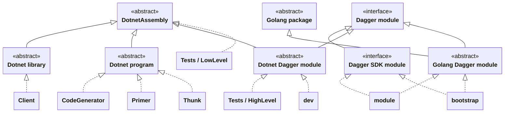

# Dagger Dotnet SDK

Dagger SDK for Dotnet.  Not official.  Maintained by https://m-pixel.com.

# Implementation Details for contributors

## Structure

- __`Client`__:  C# library that implements the parts of the Dagger C# Client that aren't procedurally generated (e.g. GraphQL connection management).
- __`CodeGenerator`__:  C# program that procedurally generates a project-specific Dagger client library based on a Dagger schema.
- __`Primer`__:  C# program that performs any cacheable analysis of a Dagger Dotnet module that is necessary to call functions from that module, but need only be run once per module-version rather than once per function-call.
- __`Thunk`__:  C# program that introspects Dotnet Dagger modules (uses reflection to produce Dagger schema), or calls an exported function, translating parameters & return values back-and-forth between Dagger's JSON and C#'s in-memory objects.
- __`module`__:  Golang Dagger module that is the Dotnet SDK's "SDK module".  Orchestrates the above components, making them actually usable by Dagger engine.
- __`bootstrap`__:  Golang Dagger module that makes it possible to use `module` without retrieving builds of `Client`, `CodeGenerator`, etc. from the internet, allowing for local iteration on the SDK's source code.
- __`Tests/LowLevel`__:  C# library containing automated tests for `Client`, `CodeGenerator`, `Primer`, and `Thunk` which are possible to run without Dagger. 
- __`Tests/HighLevel`__:  Dotnet Dagger module (using `bootstrap` as its SDK module) that implements automated tests that require a generated client library, or otherwise directly require a running Dagger engine context.
- __`dev`__:  Dotnet Dagger module (using `bootstrap` as its SDK module) that implements the `sdkBase interface` defined in `/.dagger/sdk.go`: lints, tests, publishes, and (version) bumps.

## Notes on Design Decisions

When I began developing this SDK, I actually began by copy-pasting the TypeScript SDK's source code and changing the syntax as necessary to eliminate compile errors.  After all, there are a lot of similar design choices behind TypeScript and C# (some of the same people worked on both languages).  My goal was to keep it as close as possible, so that upstream changes to the TypeScript SDK could be most easily adapted to the C# one.  To the extent that there were any improvements to be made to the TypeScript SDK, I figured I would incrementally make them to both SDKs at once.

However, after a while, I decided to break from this goal.  The code generators doesn't actually change very often.  And at a certain point, I became familiar enough with Dagger's inner-workings that it was easy enough to go straight from a change in the design spec to knowing how that should change the implementation.  Meanwhile, the cruft inherited from the other SDKs was actually becoming a nuisance.

As of now, the Dotnet SDK tries to strike the best possible balance between Dagger conventions and Dotnet idioms, while naming and structuring everything in the most expressive and maintainable way conceivable, rather than attempting to mimic other Dagger language SDKs.

### Assemblies

_Why does this SDK support loading pre-built modules?  Doesn't that go against the Dagger Modules design goal of mimicking Go, in which dependencies are referenced as GitHub repos and compiled as needed?_

Unlike other compiled languages like Go and C++, Dotnet assemblies are much easier to inspect as if they _were_ source code.  Compiling and then decompiling C# code will give you something very close to the original.  Also, dotnet assemblies can be platform-agnostic IL, which is JIT-compiled to the target platform on the fly.  So there are fewer downsides to "binary" distribution when it comes to C# as opposed to other languages.  Dotnet solved trust and compatibility problems in a different way than Go did.

When it comes to Go, the compiler is already a baseline dependency of Dagger itself.  When it comes to TypeScript and Python, the runtime and the SDK are one and the same.  There's not really any choice in the matter, any advantage to be had by pre-compiling in terms of disk size requirements (only in terms of cold start latency).

When it comes to dotnet, the SDK that is required to build the most complex potential module (one that uses a `.sln` file), is approximately a half gigabyte download; meanwhile, running pre-built modules and even compiling simple ones requires a substantially smaller (less than 100MiB) runtime.  From the perspective of a C# module developer, this probably doesn't matter much, although it might be nice to have the ability to use only their host system's dotnet SDK and not store two of them.  Others, who use your dotnet module as a dependency, or directly as a CLI tool, are likely to appreciate it at least a little bit if your module's *cold start is cut down from over 10 seconds to less than two, and requires over 400MiB less disk space*.

So, when it comes to dotnet, due to the design of the framework itself, there are opportunities afforded by pre-compilation that are non-negligible and thus worth enabling.  Ultimately, it doesn't make sense to force this Go idiom on the Dotnet SDK.  Likewise, it's easy enough to support both paths, and doesn't make sense to _require_ that modules are pre-compiled (although it is heavily encouraged).

### Naming

Some naming has been done slightly differently in this SDK as compared to the others.

**Client vs Query**:  Most Dagger SDKs rename the "Query" object to "Client" during code generation.  I found this to be incongruent with the choice of naming the base class for all Dagger object representations, "Base Client".  Indeed, _every_ object that inherits this class is a client-side representation of a Dagger object, and an API client for Dagger.  Every distinct query is rooted in the Query object, so its _internal_ name of "Query" was actually perfectly appropriate and informative.  This SDK passes through the name "Query" unchanged.

**Context vs Session**:  Most Dagger SDKs use "Context" to describe the object that owns the GraphQL connection.  While not necessarily inappropriate, it's vague.  This is the client-side representation of what the server considers to be a "session".  It is bound to a session, and the word "session" is used mostly consistently throughout the Dagger software.  Why should this be called something slightly less descriptive from the client's perspective?  This SDK calls it "Session".

**dev**:  If asked, "what's in the dev module?", you would not say "devs".  You might say "automation pipelines".  "Automation" or "Pipelines" would be a good name for this module.  As a Dotnet project, you would expect this directory to be PascalCase, at least, named "Dev" instead of "dev".  However, Dagger requires each SDK to have a module named "dev" by hard-coded convention, auto-magically binding it to `dag.{Languagename}SDKDev`.
